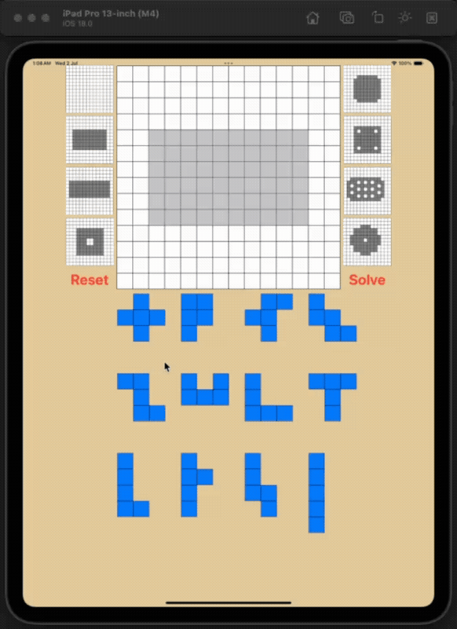
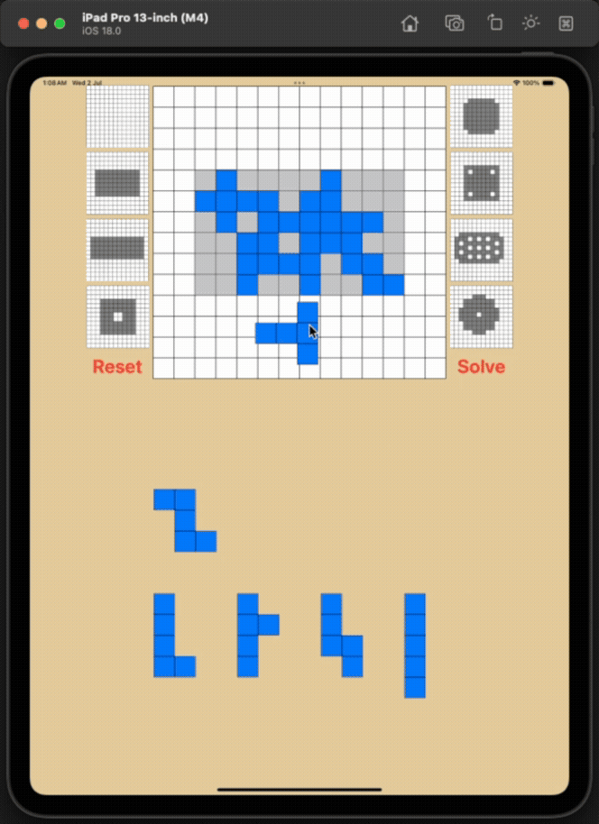
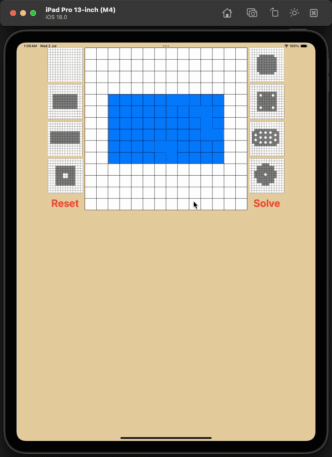

# 🧩 Pentominoes Puzzle Game

A fully interactive SwiftUI-based Pentomino puzzle game built using custom puzzle outlines, draggable/rotatable pieces, and animated solving logic. This game challenges users to place 12 unique shapes into a grid to match various puzzle board configurations, including boards with holes.

---

## 📱 Features

-   📦 12 Pentomino pieces with custom SVG-style outlines.
-   🧩 Drag, rotate (tap), and mirror (long-press) each piece.
-   🔄 Reset the board or auto-solve the current puzzle.
-   🔍 Predefined puzzle outlines including:
    -   Empty board
    -   Standard boards (6x10, 5x12)
    -   Challenging boards like OneHole, FourHoles, Flower, and 13Holes.
-   🎯 Accurate piece snapping with grid alignment.
-   🧠 Built-in solution data for automated solving.
-   📐 Real-time shape transformations (rotation, flipping) based on JSON-configured orientations.

---

## 🧱 Architecture & Concepts

This project follows a component-based architecture with MVVM-like logic separation:

| Layer            | Responsibility                                                         |
| ---------------- | ---------------------------------------------------------------------- |
| `GameManager`    | Business logic, board state, rotation/flip mechanics, puzzle selection |
| `Game`           | Core data model holding pieces, puzzle definitions, and layout         |
| `View`           | SwiftUI rendering of puzzle pieces, board, and interactivity layers    |
| `Codable Models` | Shape outlines and board layouts loaded from `.json` files             |

---

## 🗂 File Breakdown

-   `Game.swift`: Stores core puzzle state, layout grids, and pieces.
-   `GameManager.swift`: Handles logic like solving, puzzle loading, and transformations.
-   `PentominoView.swift`, `PieceView.swift`, `PiecesView.swift`: UI rendering of each shape and its interactions.
-   `PuzzleShape.swift`, `PuzzleViewWithHoles.swift`: Custom SwiftUI shapes to render puzzle outlines and internal holes.
-   `AppView.swift`: Main app layout with drag-and-drop, grid display, and puzzle selection.
-   `.json files`: Custom data files defining pentomino outlines, puzzle outlines, and solutions.

---

## 🧠 Concepts Practiced

-   🧩 Geometry & Grid Math for Piece Placement
-   📦 Codable Decoding of Game Data
-   🌀 Custom Shape Drawing in SwiftUI
-   🧲 Drag, Tap, and Long Press Gestures
-   🧠 MVC & Game Logic Coordination
-   🚀 Dynamic View Updates with `@Observable` and `@Environment`
-   🧪 Modular Testing via Controlled Reset/Solve Functions

---

## 📸 Demonstration

**🧩 Snapping and Rotating Pieces**  

**🤖 Solve Feature on Selected Puzzle**  

**🧠 Auto-Solve for All Puzzle Variants**  

---

## 🧠 Let’s Connect!

**Tej Jaideep Patel**  
B.S. Computer Engineering  
📍 Penn State University  
✉️ tejpatelce@gmail.com  
📞 814-826-5544

---
